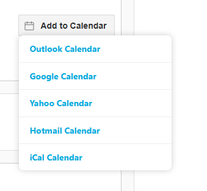
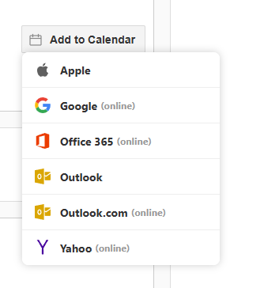

# AddToCalendar

Self-hosted, zero-dependency JavaScript replacement for AddThisEvent v1.5.8. Single file, 100% client-side, drop-in replacement requiring only a `<script src>` swap.

## Features

- **Zero dependencies** — single IIFE, no jQuery, no CDN
- **6 calendar providers** — Outlook (.ics), Google, Yahoo, Office 365, Hotmail/Outlook.com, iCal/Apple (.ics)
- **ICS generation** — client-side via Blob API with full VTIMEZONE/DST support
- **Two dropdown styles** — `default` (text-only, matches ATE) and `addevent` (icon-based)
- **Dual namespace** — `window.addthisevent` and `window.addtocalendar` (same object)
- **Dynamic content** — `refresh()` picks up anchors injected after page load
- **All-day & timed events** — correct formats for each provider

## Screenshots

| Default style | AddEvent icon style |
|:---:|:---:|
|  |  |

## Usage

```html
<a class="addthisevent" href="#">
    Add to Calendar
    <span class="_start">2/25/2026 8:00:00 AM</span>
    <span class="_end">2/25/2026 5:00:00 PM</span>
    <span class="_zonecode">11</span>
    <span class="_summary">Project Name</span>
    <span class="_description">Event description</span>
    <span class="_location">123 Main St, City, ST 12345</span>
    <span class="_all_day_event">false</span>
    <span class="_date_format">MM/DD/YYYY</span>
</a>

<script src="addtocalendar.js"></script>
<script>
    addthisevent.settings({
        css: true,
        outlook:  { show: true, text: "Outlook Calendar" },
        google:   { show: true, text: "Google Calendar" },
        yahoo:    { show: true, text: "Yahoo Calendar" },
        ical:     { show: true, text: "iCal Calendar" },
        hotmail:  { show: true, text: "Hotmail Calendar" },
        facebook: { show: false }
    });
</script>
```

### Icon-based style (AddEvent)

```javascript
addthisevent.settings({
    style: 'addevent',
    iconPath: 'img/',
    css: true,
    facebook: { show: false }
});
```

Requires SVG icons in the `iconPath` directory: `apple.svg`, `google.svg`, `office365.svg`, `outlook.svg`, `yahoo.svg`.

## API

| Method | Description |
|--------|-------------|
| `addthisevent.settings(config)` | Configure providers, CSS injection, and dropdown style |
| `addthisevent.refresh()` | Scan for new `.addthisevent` anchors (for dynamic content) |

### Settings options

| Option | Type | Default | Description |
|--------|------|---------|-------------|
| `css` | boolean | `true` | Inject default stylesheet |
| `mouse` | boolean | `false` | Mouse hover behavior |
| `style` | string | `'default'` | `'default'` or `'addevent'` (icon layout) |
| `iconPath` | string | `'img/'` | Base path to provider icon SVGs |
| `outlook` | object | `{ show: true, text: 'Outlook Calendar' }` | Outlook (.ics download) |
| `google` | object | `{ show: true, text: 'Google Calendar' }` | Google Calendar (URL) |
| `yahoo` | object | `{ show: true, text: 'Yahoo Calendar' }` | Yahoo Calendar (URL) |
| `ical` | object | `{ show: true, text: 'iCal Calendar' }` | iCal/Apple (.ics download) |
| `hotmail` | object | `{ show: true, text: 'Hotmail Calendar' }` | Outlook.com (URL) |
| `office365` | object | `{ show: true, text: 'Office 365 Calendar' }` | Office 365 (URL) |
| `facebook` | object | `{ show: true, text: 'Facebook Calendar' }` | Facebook Events (URL) |

## Testing

**Browser:** Open `test/test.html` (default style) or `test/test-addevent.html` (icon style).

**Node.js:**
```bash
node test/test-node.js
```

## License

MIT License

Copyright (c) 2025

Permission is hereby granted, free of charge, to any person obtaining a copy
of this software and associated documentation files (the "Software"), to deal
in the Software without restriction, including without limitation the rights
to use, copy, modify, merge, publish, distribute, sublicense, and/or sell
copies of the Software, and to permit persons to whom the Software is
furnished to do so, subject to the following conditions:

The above copyright notice and this permission notice shall be included in all
copies or substantial portions of the Software.

THE SOFTWARE IS PROVIDED "AS IS", WITHOUT WARRANTY OF ANY KIND, EXPRESS OR
IMPLIED, INCLUDING BUT NOT LIMITED TO THE WARRANTIES OF MERCHANTABILITY,
FITNESS FOR A PARTICULAR PURPOSE AND NONINFRINGEMENT. IN NO EVENT SHALL THE
AUTHORS OR COPYRIGHT HOLDERS BE LIABLE FOR ANY CLAIM, DAMAGES OR OTHER
LIABILITY, WHETHER IN AN ACTION OF CONTRACT, TORT OR OTHERWISE, ARISING FROM,
OUT OF OR IN CONNECTION WITH THE SOFTWARE OR THE USE OR OTHER DEALINGS IN THE
SOFTWARE.

## Credits

> **Notice:** This project is AI-generated, built for personal use only. Tested but use with care.

- **Author:** Claude Opus 4.6
- **Tested by:** Cosme Zamudio
